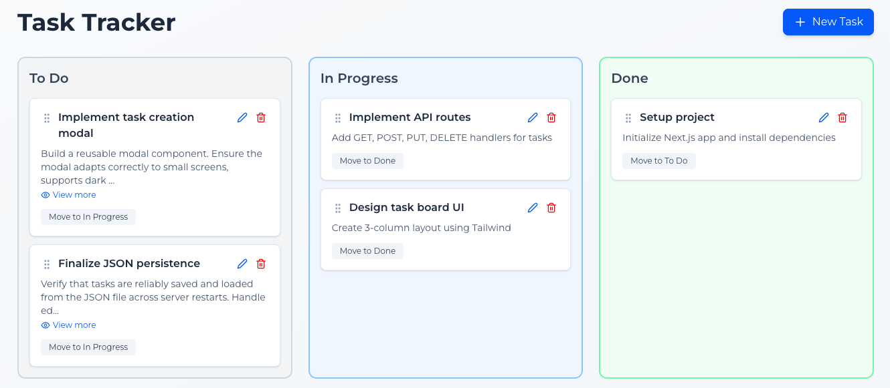
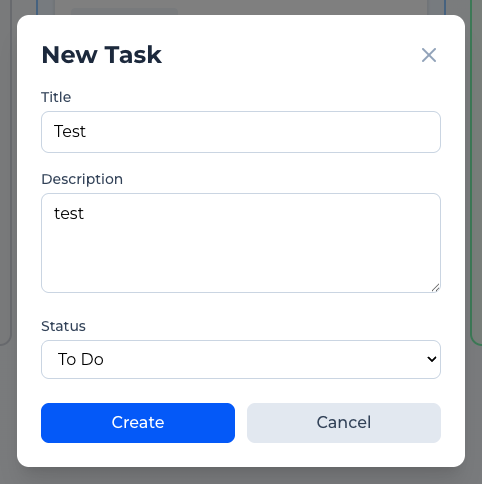
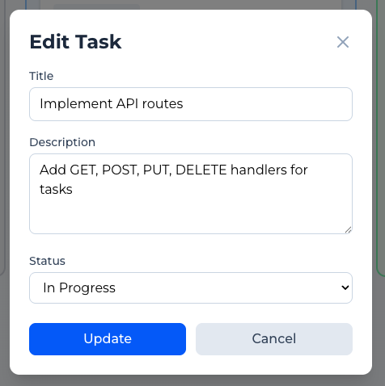
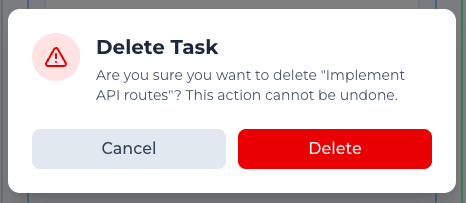

# Task Tracker

## Table of Contents
- [About](#about)
- [Screenshots](#screenshots)
- [Installation](#installation)
- [Usage guide](#usage-guide)
- [FAQ](#faq)
- [Contacts and support](#contacts-and-support)

## About
The Task Tracker is a simple web application that helps users manage their tasks efficiently.

Each task contains a title, description, and status ("To Do", "In Progress", or "Done"). Tasks are displayed in three columns based on their status, allowing users to clearly track progress.

The application includes:
- Component-based UI design
- File-based data persistence
- REST-style API endpoints
- Drag-and-drop interactions


## Screenshots
Task Board   
  

Add task modal   
  

Edit task modal   
  

Delete task modal   
  

## Installation
### *Requirements*
- Node.js version 20.9.0 or later
- npm or yarn
- web browser

### *Installation steps*
1. Clone the repository
```
git clone https://github.com/mushmushroom/Orbios_Task-Tracker.git
cd task-tracker
```

2. Install dependencies:
```
npm install
# or
yarn install
```

3. Run the development server:
```
npm run dev
# or
yarn dev
```

4. Open your browser and go to http://localhost:3000


## Usage guide

### *Add task*
1. Click "New task" button.
2. Fill in the task title, description and select a status.
3. Click "Create" to save the task or "Cancel" to close the modal (the task will not be saved)

### *Change status*
Drag a task to another columns  
**OR**  
Use the status change button on the task   
**OR**  
Edit the task selecting a new status

### *Edit task*
1. Click Edit button on a task card to update its details
2. Click "Update" to save the changes.

### *Delete task*
1. Click Delete button on a task card.
2. Click "Delete" on a modal to delete the task or "Cancel" to undo this action.

## FAQ
### *Where are tasks stored?*
Tasks are stored in a local JSON file (src/data/tasks.json).

### *How can I reset all tasks?*
You can reset all tasks by clearing the contents of the tasks.json file.

### *Can I switch to a database instead of JSON?*
Yes. The file-based storage can be replaced with a database such as SQLite, PostgreSQL, or MongoDB. For this you will need to update the logic in helper functions and API endpoints.

### *Does this app support multiple users?*
No. This application uses local file storage and is intended for single-user or demo purposes only.


## Contacts and support
If you encounter issues or have questions about the project, please contact:  
Developer: Maria Smirnitska  
Email: smirnitskayamp@gmail.com  
GitHub: https://github.com/mushmushroom  